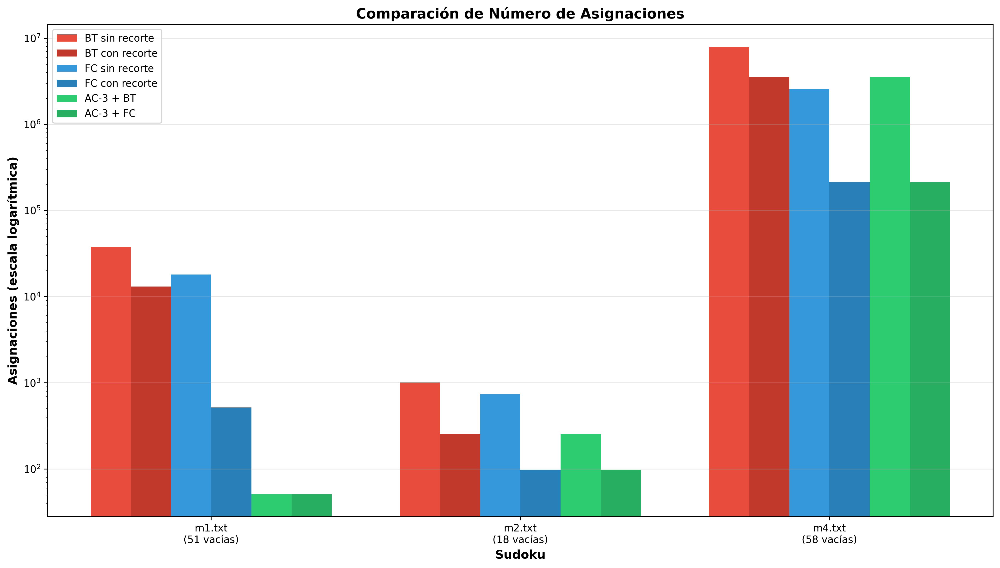
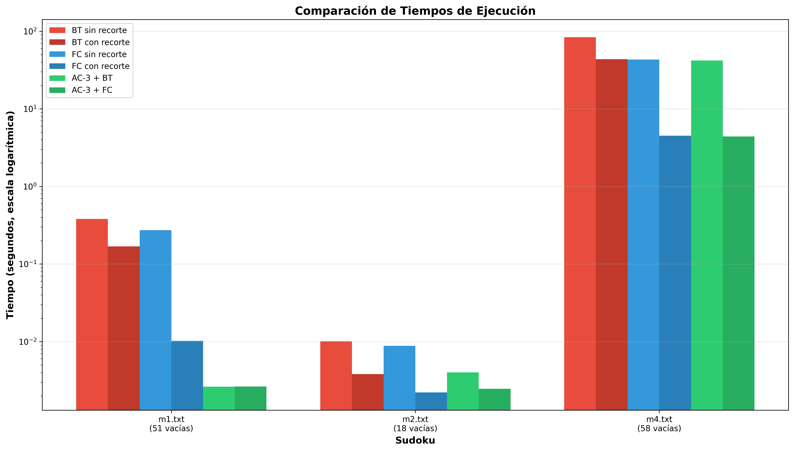
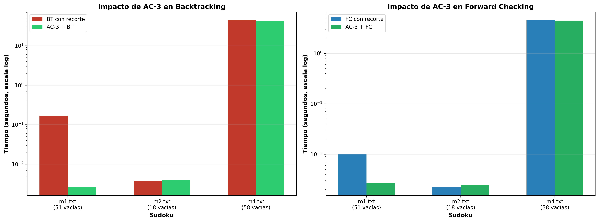
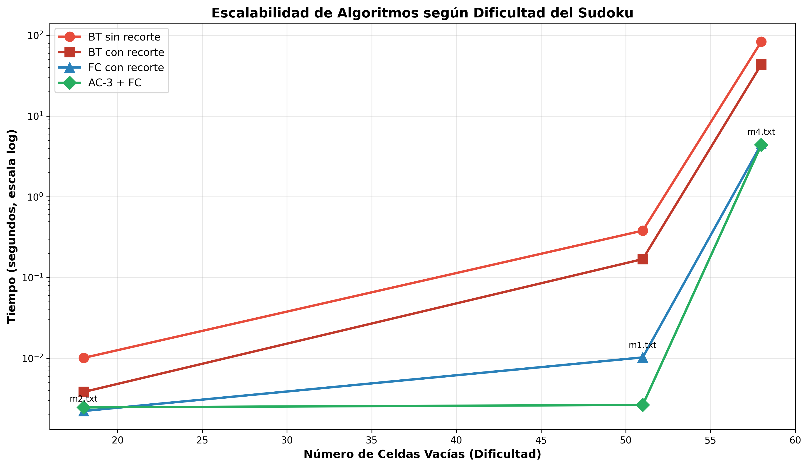

# Memoria  - Resolución de Sudoku mediante CSP

**Nombre:** Alberto Sallés Ibarra  
**DNI:** 74443449Q


---

## 1. Clase Variable

### Estructura
```python
@dataclass
class Variable:
    fila: int              # Posición fila [0-8]
    col: int               # Posición columna [0-8]
    valor: Optional[int]   # Valor asignado [1-9] o None
    fija: bool             # True si celda inicial
    dominio: List[int]     # Valores posibles [1-9]
```

### Decisiones de Diseño
- **Dataclass**: Simplicidad, sin métodos complejos innecesarios
- **Dominio**: Lista mutable para podas durante AC-3 y FC
- **Atributo `fija`**: Identifica celdas del tablero inicial (inmutables)
- **Dominio de celdas fijas**: `[valor_fijo]` (unitario) para consistencia
image.png
---

## 2. Tratamiento de Celdas Fijas

### Identificación
Las celdas fijas se determinan al crear las variables:
```python
ch_inicial = copTab.getCelda(f, c)
if ch_inicial != '0':
    var = Variable(fila=f, col=c, valor=int(ch_inicial), 
                   fija=True, dominio=[int(ch_inicial)])
else:
    var = Variable(fila=f, col=c, valor=None, 
                   fija=False, dominio=[...])
```

### Propiedades
- **Dominio unitario**: `[valor_fijo]`
- **Inmutabilidad**: No se modifican durante la búsqueda
- **AC-3**: No se incluyen en la cola de arcos (no cambian)
- **BT/FC**: Se saltan en la selección de variables mediante `not var.fija`

---

## 3. Especificación Formal del Problema

### Tupla CSP: ⟨V, E, c, I, a⟩

#### V - Variables
```
V = {V_{i,j} | i,j ∈ [0,8], celda (i,j) no fija}
|V| = 81 - |celdas_fijas|
```

#### E - Dominios
```
E = {D_{i,j} | D_{i,j} ⊆ {1,2,3,4,5,6,7,8,9}}

Donde D_{i,j} = {v ∈ [1,9] | v ∉ valores_vecinos(i,j)} si recorte activado
        D_{i,j} = {1,2,3,4,5,6,7,8,9}                      en caso contrario
```

#### c - Restricciones
**Restricción binaria:** `≠` (diferente)

Para cada par de variables vecinas `⟨V_{i,j}, V_{k,l}⟩`:
```
c(V_{i,j}, V_{k,l}) ≡ V_{i,j} ≠ V_{k,l}
```

**Vecindad:** `V_{k,l}` es vecina de `V_{i,j}` si:
- Misma fila: `i = k ∧ j ≠ l`
- Misma columna: `i ≠ k ∧ j = l`
- Misma caja 3×3: `⌊i/3⌋ = ⌊k/3⌋ ∧ ⌊j/3⌋ = ⌊l/3⌋ ∧ (i,j) ≠ (k,l)`

#### I - Valores Iniciales
```
I = {(i,j,v) | celda (i,j) tiene valor fijo v}
```

#### a - Arcos
```
a = {⟨V_{i,j}, V_{k,l}⟩ | V_{k,l} ∈ vecinos(V_{i,j})}
|a| ≈ |V| × 20  (cada variable tiene ~20 vecinos)
```

---

## 4. Experimentación

### 4.1 Configuración de Pruebas

| Sudoku | Celdas Fijas | Celdas Vacías | Dificultad |
|--------|--------------|---------------|------------|
| m1.txt | 30 | 51 | Alta |
| m2.txt | 63 | 18 | Baja |
| m4.txt | 23 | 58 | Muy Alta |

### 4.2 Algoritmos Evaluados

1. **BT sin recorte**: Dominios completos [1-9], comprueba restricciones
2. **BT con recorte**: Dominios reducidos inicialmente
3. **FC sin recorte**: Dominios completos [1-9], poda durante búsqueda
4. **FC con recorte**: Dominios reducidos + poda durante búsqueda
5. **AC-3 + BT**: Preprocesamiento + Backtracking
6. **AC-3 + FC**: Preprocesamiento + Forward Checking

El recorte de dominios implementado, reduce los dominios de las variables antes de iniciar la búsqueda, eliminando valores que ya sabemos que son incompatibles con las restricciones iniciales (celdas fijas del sudoku). El orden de selección de las variables es fijo.

### 4.3 Resultados Experimentales

#### m1.txt (51 celdas vacías)

| Algoritmo | Recursiones | Asignaciones | Tiempo (s) |
|-----------|-------------|--------------|------------|
| BT sin recorte | 4,209 | 37,652 | 0.3811 |
| BT con recorte | 4,209 | 13,085 | 0.1691 |
| FC sin recorte | 4,209 | 18,092 | 0.2730 |
| FC con recorte | 334 | 516 | 0.0102 |
| AC-3 + BT | 52 | 51 | 0.0026 |
| AC-3 + FC | 52 | 51 | 0.0026 |

**Observaciones:**
- Recorte inicial reduce asignaciones en BT en 65.2% (37,652 → 13,085)
- FC sin recorte hace 52.0% menos asignaciones que BT sin recorte
- FC con recorte reduce recursiones en 92.1% vs BT (4,209 → 334)
- AC-3 resuelve completamente el sudoku (todos los dominios → tamaño 1)
- AC-3 + FC es **144× más rápido** que BT sin recorte
- FC con recorte reduce asignaciones en 98.6% vs BT sin recorte

#### m2.txt (18 celdas vacías)

| Algoritmo | Recursiones | Asignaciones | Tiempo (s) |
|-----------|-------------|--------------|------------|
| BT sin recorte | 118 | 1,010 | 0.0101 |
| BT con recorte | 118 | 255 | 0.0038 |
| FC sin recorte | 118 | 741 | 0.0088 |
| FC con recorte | 82 | 98 | 0.0022 |
| AC-3 + BT | 118 | 255 | 0.0040 |
| AC-3 + FC | 82 | 98 | 0.0025 |

**Observaciones:**
- Recorte inicial reduce asignaciones en 74.8% (1,010 → 255)
- FC sin recorte reduce asignaciones en 26.6% vs BT sin recorte
- FC con recorte reduce recursiones en 30.5% (118 → 82)
- AC-3 no mejora más allá del recorte inicial para este sudoku fácil
- Encontramos un punto de equilibrio para AC-3 (0.0002s) no compensa en problemas simples

#### m4.txt (58 celdas vacías - Muy difícil)

| Algoritmo | Recursiones | Asignaciones | Tiempo (s) |
|-----------|-------------|--------------|------------|
| BT sin recorte | 879,418 | 7,914,530 | 83.74 |
| BT con recorte | 879,418 | 3,563,873 | 43.64 |
| FC sin recorte | 850,980 | 2,568,163 | 43.21 |
| FC con recorte | 137,709 | 213,850 | 4.50 |
| AC-3 + BT | 879,418 | 3,563,873 | 42.05 |
| AC-3 + FC | 137,709 | 213,850 | 4.39 |

**Observaciones:**
- Problema extremadamente complejo: BT sin recorte tarda **83.74 segundos**
- Recorte inicial reduce asignaciones en BT en 55.0% (7.9M → 3.6M)
- FC sin recorte reduce asignaciones en 67.6% vs BT sin recorte (enorme mejora)
- FC con recorte reduce recursiones en 84.3% (879K → 138K)
- FC con recorte es **18.6× más rápido** que BT sin recorte
- AC-3 no aporta mejora significativa (tiempo AC-3: 0.0019s despreciable, pero no reduce dominios suficientemente)
- Para este nivel de dificultad, **FC con recorte es la mejor opción**
- Demuestra que FC escala mucho mejor que BT en problemas muy complejos

---

## 5. Estudio de Tiempos

### 5.1 Impacto del Recorte Inicial

**m1.txt:**
```
Tiempo BT sin recorte: 0.3811s
Tiempo BT con recorte: 0.1691s
Mejora: 55.6%

Tiempo FC sin recorte: 0.2730s
Tiempo FC con recorte: 0.0102s
Mejora: 96.3%
```

**m2.txt:**
```
Tiempo BT sin recorte: 0.0101s
Tiempo BT con recorte: 0.0038s
Mejora: 62.4%

Tiempo FC sin recorte: 0.0088s
Tiempo FC con recorte: 0.0022s
Mejora: 75.0%
```

**m4.txt:**
```
Tiempo BT sin recorte: 83.74s
Tiempo BT con recorte: 43.64s
Mejora: 47.9%

Tiempo FC sin recorte: 43.21s
Tiempo FC con recorte: 4.50s
Mejora: 89.6%
```

**Conclusión:** El recorte inicial mejora significativamente el rendimiento. El impacto es mayor en FC (75-90%) que en BT (48-62%). En problemas extremadamente complejos (m4.txt), el recorte ahorra hasta 40 segundos en BT y 39 segundos en FC.

### 5.2 Comparación BT vs FC

**m1.txt (problema difícil):**
- **Sin recorte**: FC es 28% más rápido que BT (0.2730s vs 0.3811s)
- **Con recorte**: FC es **94% más rápido** que BT (0.0102s vs 0.1691s)

**m2.txt (problema fácil):**
- **Sin recorte**: FC es 13% más rápido que BT (0.0088s vs 0.0101s)
- **Con recorte**: FC es 42% más rápido que BT (0.0022s vs 0.0038s)

**m4.txt (problema muy difícil):**
- **Sin recorte**: FC es 48% más rápido que BT (43.21s vs 83.74s)
- **Con recorte**: FC es **90% más rápido** que BT (4.50s vs 43.64s)

**Conclusión:** FC supera consistentemente a BT. La ventaja es mayor con recorte de dominios y se amplifica dramáticamente en problemas más complejos (hasta 90% más rápido en m4.txt).

### 5.3 Impacto de AC-3

#### m1.txt (Sudoku Difícil)

| Método | Sin AC-3 | Con AC-3 | Mejora |
|--------|----------|----------|--------|
| BT | 0.1691s | 0.0026s | **98.5%** |
| FC | 0.0102s | 0.0026s | **74.5%** |

**Análisis:**
- AC-3 tiempo: 0.0014s (despreciable comparado con beneficio)
- Para m1.txt, AC-3 resuelve el problema completamente
- BT/FC solo asignan los 51 valores únicos resultantes
- AC-3 elimina el backtracking casi por completo

#### m2.txt (Sudoku Fácil)

| Método | Sin AC-3 | Con AC-3 | Mejora |
|--------|----------|----------|--------|
| BT | 0.0038s | 0.0040s | -5.3% |
| FC | 0.0022s | 0.0025s | -13.6% |

**Análisis:**
- AC-3 tiempo: 0.0002s
- AC-3 no aporta mejora (alcanza mismo punto fijo que recorte inicial)
- Para sudokus fáciles con buen recorte inicial, AC-3 es innecesario

#### m4.txt (Sudoku Muy Difícil)

| Método | Sin AC-3 | Con AC-3 | Mejora |
|--------|----------|----------|--------|
| BT | 43.64s | 42.05s | **3.6%** |
| FC | 4.50s | 4.39s | **2.4%** |

**Análisis:**
- AC-3 tiempo: 0.0019s (despreciable)
- AC-3 no reduce significativamente el espacio de búsqueda
- Para problemas muy complejos donde AC-3 no alcanza consistencia total, el beneficio es mínimo
- **FC con recorte** (sin AC-3) es la mejor opción: balance óptimo velocidad/simplicidad
- AC-3 es más efectivo cuando puede resolver el problema casi completamente (como m1.txt)

### 5.4 Conclusión sobre Tiempos

**Eficacia de AC-3 según dificultad:**
- **Muy útil (m1.txt - 51 vacías)**: AC-3 resuelve completamente → mejora 98.5% en BT, 74.5% en FC
- **Inútil (m2.txt - 18 vacías)**: AC-3 no aporta nada → empeora ligeramente por overhead
- **Poco útil (m4.txt - 58 vacías)**: AC-3 no reduce suficientemente → mejora solo 3.6% en BT, 2.4% en FC

**Hallazgo clave:** AC-3 es útil cuando puede reducir significativamente el espacio de búsqueda. En problemas muy complejos donde no alcanza consistencia total, el beneficio es mínimo.


**Conclusión general:** FC con recorte es la mejor opción para la mayoría de sudokus, ofreciendo excelente rendimiento sin complejidad adicional.

---

## 6. Análisis Gráfico

### Gráfica 1: Comparación de Asignaciones



**Observaciones:**
- Escala logarítmica para evidenciar diferencias de órdenes de magnitud
- m4.txt: BT sin recorte realiza 7.9 millones de asignaciones al ser un problema muy complejo.
- m1.txt: FC con recorte reduce asignaciones en 98.6% vs BT sin recorte
- AC-3 reduce a mínimo en m1.txt (51 asignaciones) pero no en m4.txt
- m4.txt demuestra la importancia crítica de FC en problemas complejos

### Gráfica 2: Comparación de Tiempos



**Observaciones:**
- Correlación directa asignaciones-tiempo
- m4.txt: BT sin recorte tarda **83.74 segundos** siendo extremadamente lento
- m4.txt: FC con recorte resuelve en **4.50 segundos** (18.6× más rápido que BT)
- m1.txt: Diferencias de 2 órdenes de magnitud entre extremos
- m2.txt: Problema simple, todos los métodos son rápidos (<0.01s)
- FC con recorte ofrece mejor balance velocidad/complejidad sin AC-3
- La escala logarítmica es necesaria por el rango enorme (0.002s a 83s)

### Gráfica 3: Impacto Específico de AC-3



**Observaciones:**
- m1.txt: AC-3 transforma radicalmente el problema (98% reducción en BT)
- m2.txt: AC-3 añade overhead sin beneficio significativo (empeora ligeramente)
- m4.txt: AC-3 aporta mejora mínima (solo 2-3% más rápido)
- AC-3 es efectivo solo cuando puede reducir drásticamente el espacio de búsqueda
- m4.txt refuta la hipótesis de "más celdas vacías → mayor beneficio de AC-3"

### Gráfica 4: Escalabilidad por Dificultad



**Observaciones:**
- Tendencia: a mayor dificultad, mayor diferencia entre algoritmos
- BT sin recorte: crecimiento exponencial (0.01s → 0.38s → 83.74s)
- BT con recorte: crecimiento exponencial pero más lento (0.004s → 0.17s → 43.64s)
- FC con recorte: crecimiento casi lineal (0.002s → 0.01s → 4.50s)
- AC-3 + FC: efectivo solo en casos específicos (m1.txt)
- **Conclusión visual**: FC con recorte escala mejor que cualquier otra opción

---

## 7. Análisis Detallado: FC con y sin Recorte

### ¿Por qué FC funciona sin recorte?

**m1.txt - FC sin recorte:**
- Recursiones: 4,209 (igual que BT)
- Asignaciones: 18,092 (52% menos que BT sin recorte: 37,652)

**m4.txt - FC sin recorte:**
- Recursiones: 850,980 (similar a BT: 879,418)
- Asignaciones: 2,568,163 (67.6% menos que BT sin recorte: 7,914,530)

**Mecanismo:**
1. FC **NO comprueba restricciones** explícitamente como BT
2. FC **poda dominios** de variables futuras al asignar
3. Sin recorte inicial, FC debe explorar más caminos (más recursiones)
4. Pero cada asignación poda valores inválidos de vecinos no asignados
5. Esto evita asignaciones futuras que BT haría y luego rechazaría

**Diferencia clave con BT:**
- BT: Asigna valor → Comprueba validez → Rechaza si inválido
- FC: Asigna valor → Poda vecinos → Detecta dominios vacíos temprano

**Impacto del recorte en FC:**

| Sudoku | Sin recorte | Con recorte | Mejora |
|--------|-------------|-------------|--------|
| m1.txt | 0.2730s (4,209 rec) | 0.0102s (334 rec) | **96.3%** (27×) |
| m2.txt | 0.0088s (118 rec) | 0.0022s (82 rec) | **75.0%** (4×) |
| m4.txt | 43.21s (851K rec) | 4.50s (138K rec) | **89.6%** (9.6×) |

**Conclusión:** El recorte inicial es **crítico** para FC, con mejoras de 4× a 27× en rendimiento.

---

## 8. Conclusiones

### Rendimiento de Algoritmos

| Métrica | Orden (mejor→peor) |
|---------|-------------------|
| **Tiempo** | AC-3+FC > AC-3+BT > FC_recorte > BT_recorte > FC_puro > BT_puro |
| **Asignaciones** | AC-3+* > FC_recorte > BT_recorte > FC_puro > BT_puro |
| **Recursiones** | AC-3+FC > FC_recorte > BT_* |

### Optimizaciones Efectivas

1. **Recorte inicial**: Mejora universal (48-96% según algoritmo y problema)
   - m4.txt: Ahorra 40s en BT, 39s en FC
2. **Forward Checking**: Reduce recursiones dramáticamente
   - m1.txt: 92% reducción (4,209 → 334)
   - m4.txt: 84% reducción (879K → 138K)
3. **AC-3**: Efectivo solo en casos específicos
   - m1.txt: 98% mejora (resuelve completamente)
   - m4.txt: 2-3% mejora (no reduce suficientemente)

### Comportamiento por Dificultad

**Problemas Muy Difíciles (>55 vacías - m4.txt):**
- FC con recorte: **4.50s** (mejor opción)
- AC-3 aporta mejora mínima (2-3%)
- BT con recorte: 43.64s (10× más lento que FC)
- BT sin recorte: 83.74s (impracticable)

**Problemas Difíciles (45-55 vacías - m1.txt):**
- AC-3 altamente efectivo (puede resolver completamente)
- AC-3 + FC: **0.0026s** (óptimo)
- FC con recorte: 0.0102s (excelente sin AC-3)

**Problemas Moderados (20-40 vacías):**
- FC con recorte es óptimo
- AC-3 probablemente no aporta mejora significativa

**Problemas Fáciles (<20 vacías - m2.txt):**
- Todos los métodos son rápidos (<0.01s)
- AC-3 añade overhead innecesario
- FC con recorte: 0.0022s (óptimo)

### Aportación Técnica

Se demuestra empíricamente que:

1. **Forward Checking es superior a Backtracking de forma consistente:**
   - Ventaja amplificada en problemas complejos (90% más rápido en m4.txt)
   - Escala mejor: crecimiento casi lineal vs exponencial
   
2. **AC-3 no siempre mejora con más celdas vacías:**
   - m1.txt (51 vacías): Mejora 98% ✓
   - m4.txt (58 vacías): Mejora 3% ✗
   - **Conclusión**: La estructura del problema importa más que el tamaño
   
3. **El recorte de dominios es crítico:**
   - Beneficia a todos los algoritmos (48-96% mejora)
   - Especialmente importante para FC (27× más rápido en m1.txt)
   
4. **Recomendación general:**
   - **FC con recorte** es la mejor opción para la mayoría de sudokus
   - Solo usar AC-3 si se sabe que resuelve casi completamente el problema
   - BT solo para problemas triviales


## 9. Uso de IAs generativas


Durante el desarrollo de este proyecto se han hecho uso de herramientas como Gemini, Cursor, Claude y ChatGpt. Esencialmente Gemini y ChatGpt se han empleado para la formalización del problema, el establecimiento de una hoja de ruta para el desarrollo y para asegurar una correcta comprensión y entendimiento de la práctica y los algoritmos requeridos. En el fin de agilizar, revisar y depurar la integración de estos algoritmos, las herramientas empleadas han sido Cursor y Claude. 

Así mismo también, Claude han prestado apoyo generado scripts para la elaboración de las gráficas y la elaboración de la memoria. Documentación elaborada y exportada en Notion.


## 10. Referencias

- Youtube:
 Playlist Constraint Satisfaction Problems (CSP): https://youtube.com/playlist?list=PL9EkTCQPPVmBL94p6ahSSVBIBOWKDURn1&si=Ob9V3mVtr75BxqCa
 - Youtube: Sudoku Solver (Backtraking): https://www.youtube.com/watch?v=eAFcj_2quWI&t=151s
 - Documentación de clase: Moodle 
 - Dudas al profesor de prácticas

---


